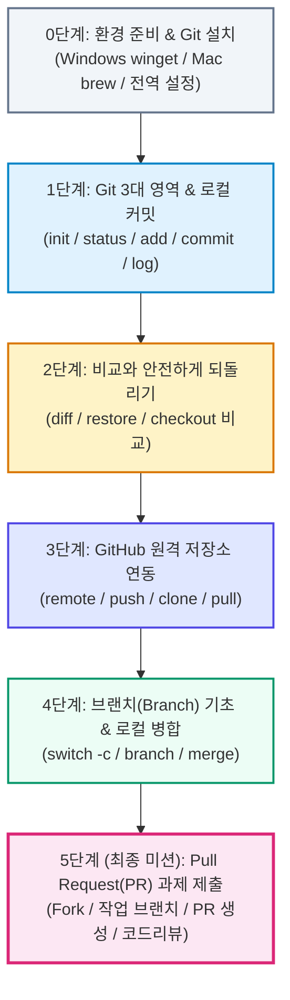
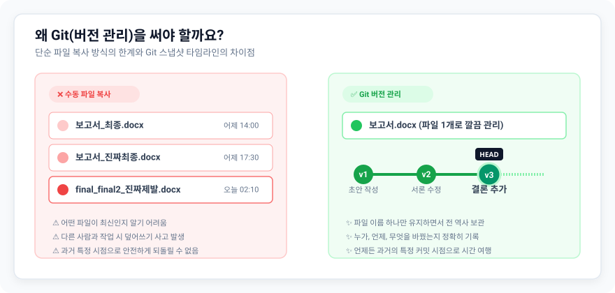
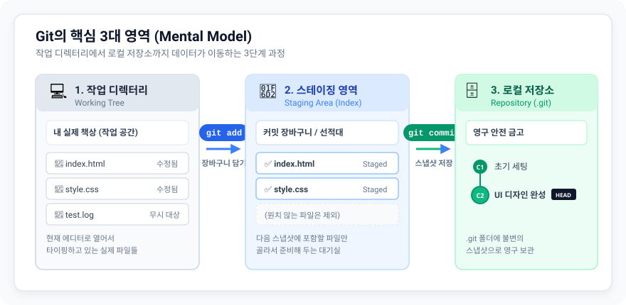
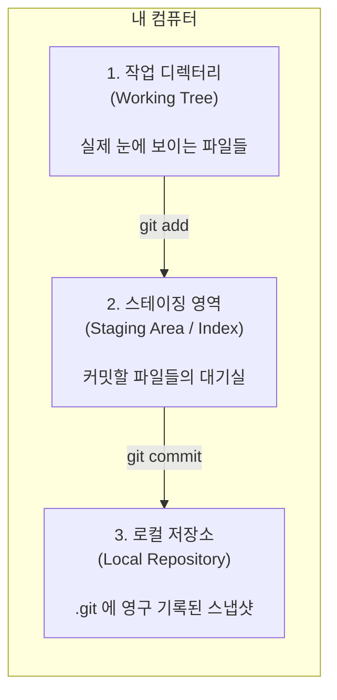
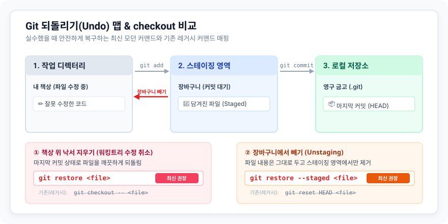
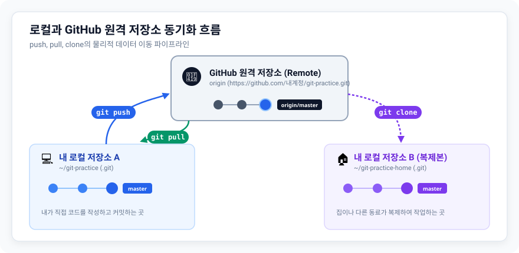
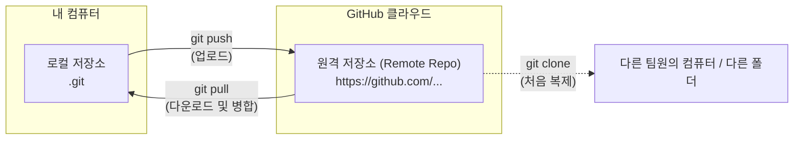
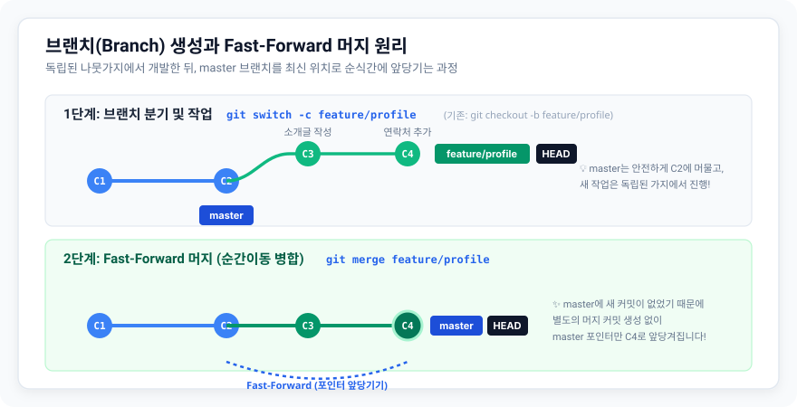
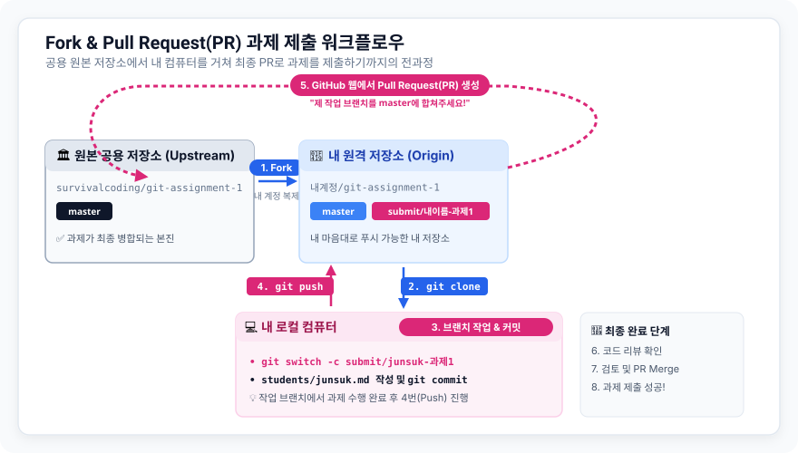

# [Hands-on] Git & GitHub 기초부터 첫 PR(과제 제출)까지

> **과정명**: 비전공자/주니어 개발자를 위한 Git & GitHub 실전 핸즈온 (Day 1)  
> 생존코딩 오준석  
> **진행 방식**: 설명 20% + 실습 80%의 구글 Codelab 따라하기 방식  
> **최종 목표**: 로컬 버전 관리 기본기를 체득하고, GitHub에서 **브랜치 기반 Pull Request(PR)로 과제 제출**을 성공적으로 완료한다.

---

## 🧭 학습 로드맵 (Day 1 Flow)



---

## 📑 목차 (Table of Contents)

1. [0단계: 환경 준비 & Git 첫걸음 (설치와 초기 설정)](#0단계-환경-준비--git-첫걸음-설치와-초기-설정)
2. [1단계: Git의 3대 영역과 로컬 버전 관리 (기본 커맨드)](#1단계-git의-3대-영역과-로컬-버전-관리-기본-커맨드)
3. [2단계: 변경 사항 비교와 안전하게 되돌리기 (Undo & Checkout 비교)](#2단계-변경-사항-비교와-안전하게-되돌리기-undo--checkout-비교)
4. [3단계: GitHub 원격 저장소(Remote) 연동과 동기화](#3단계-github-원격-저장소remote-연동과-동기화)
5. [4단계: 브랜치(Branch) 기초와 평화로운 병합 (Merge)](#4단계-브랜치branch-기초와-평화로운-병합-merge)
6. [5단계 (최종 미션): 협업의 꽃! Pull Request(PR)로 과제 제출하기](#5단계-최종-미션-협업의-꽃-pull-requestpr로-과제-제출하기)
7. [Day 1 마무리 및 Day 2 예고](#day-1-마무리-및-day-2-예고)

---

## 0단계: 환경 준비 & Git 첫걸음 (설치와 초기 설정)

> 🎯 **핵심 목표**: 버전 관리의 필요성을 이해하고, 내 운영체제에 Git을 설치하며 필수 전역 설정을 마칩니다.

### 0.1 버전 관리(VCS)란 무엇인가?



우리가 Git을 배우지 않았을 때 흔히 겪는 폴더 상태입니다:

```text
📁 내프로젝트_진짜_최종/
├── 보고서_최종.docx
├── 보고서_진짜최종.docx
├── 보고서_진짜진짜최종_수정본.docx
└── 보고서_제출용_final_final2_제발.docx
```

- **문제점 1**: 어떤 파일이 최신인지 알기 어렵습니다.
- **문제점 2**: 누가, 언제, 왜 이 줄을 고쳤는지 이력을 알 수 없습니다.
- **문제점 3**: 다른 사람과 동시에 편집하면 한 사람의 작업이 덮어쓰여 사라집니다.

**Git**(깃)은 소프트웨어 개발에서 소스 코드의 변경 이력을 스냅샷 형태로 기록하는 **분산 버전 관리 시스템**(Distributed VCS)입니다. 파일 이름에 날짜나 `_최종`을 붙이지 않아도, 언제든 과거의 특정 시점으로 안전하게 돌아가거나 변경 내역을 한눈에 대조할 수 있습니다.

---

### 0.2 Git 설치하기

터미널을 열고 먼저 Git이 이미 설치되어 있는지 확인합니다.

```bash
git --version
```

버전 정보(예: `git version 2.4x.x`)가 출력된다면 설치를 건너뛰고 [0.3 Git 필수 전역 설정](#03-git-필수-전역-설정-global-config)으로 이동하세요.

---

#### 🪟 Windows 사용자 가이드

Windows에서는 복잡한 마법사 옵션 대신 **Windows 패키지 관리자**(`winget`)를 사용하면 한 줄로 깔끔하게 설치할 수 있습니다.

PowerShell을 실행하고 아래 명령을 입력합니다:

```powershell
winget install Git.Git
```

> [!TIP]
> **Scoop 사용자라면:**
>
> ```powershell
> scoop install git
> ```
>
> 패키지 매니저 실행이 어렵다면 공식 웹사이트([git-scm.com](https://git-scm.com/download/win))에서 설치 파일(64-bit Git for Windows Setup)을 다운로드하여 기본 옵션(Next 연타)으로 설치하셔도 무방합니다.

설치가 완료되면 **반드시 열려 있는 PowerShell/터미널 창을 닫고 새로 열어야** `git` 명령어가 인식됩니다.

---

#### 🍎 macOS 사용자 가이드

터미널(Terminal)을 열고 **Homebrew**로 설치합니다:

```bash
brew install git
```

> [!NOTE]
> Homebrew가 없다면 터미널에 `git`을 입력했을 때 나타나는 **"Xcode 명령줄 개발자 도구(Command Line Developer Tools)"** 설치 팝업에서 [설치]를 클릭하시면 자동으로 기본 Git이 구성됩니다.

---

#### 💡 [전문가 조언] 윈도우 개발자의 터미널 선택: PowerShell vs Git Bash vs WSL2

Windows 환경에서 개발할 때 "어떤 터미널을 써야 할까?" 많은 고민이 생깁니다.

| 터미널 환경       | 특징 및 용도                                                                                                            |               추천도               |
| :---------------- | :---------------------------------------------------------------------------------------------------------------------- | :--------------------------------: |
| **PowerShell**    | • Windows의 기본 강력한 셸<br>• 간단한 Git 명령어 실습에 충분                                                           |          ⭐️⭐️⭐️ (입문용)           |
| **Git Bash**      | • Git for Windows 설치 시 함께 제공되는 가벼운 MinGW Bash 환경<br>• Linux 기본 명령어(`ls`, `grep`, `cat` 등) 사용 가능 |         ⭐️⭐️⭐️⭐️ (실습용)          |
| **WSL2 (Ubuntu)** | • Windows 위에서 **진짜 리눅스 커널**을 실행하는 환경<br>• 실무 백엔드/AI/도커 개발의 사실상 표준                       | ⭐️⭐️⭐️⭐️⭐️ **(장기적 강력 추천!)** |

> [!IMPORTANT]
> **장기적으로 왜 개발자들은 WSL2를 쓰게 될까요?**
> 실무 서버 환경은 99% Linux(Ubuntu, CentOS 등)입니다. 배포 스크립트, Docker 컨테이너, 파일 경로 구분자(`/` vs `\`), 줄바꿈 코드(`LF` vs `CRLF`) 등에서 Windows와 Linux 사이의 미묘한 차이로 버그가 자주 발생합니다.
>
> 지금 당장의 기초 실습은 **PowerShell이나 Git Bash**로도 충분하지만, 향후 본격적인 풀스택/AI/서버 개발을 이어가실 계획이라면 **WSL2**(Ubuntu)를 설치하여 VS Code의 "WSL 연동 확장"을 통해 개발 환경을 꾸미시는 것을 강력하게 추천합니다.
> _(설치 방법: PowerShell 관리자 모드에서 `wsl --install`)_

---

### 0.3 Git 필수 전역 설정 (Global Config)

Git을 설치한 뒤 가장 먼저 해야 할 일은 **"내가 누구인지(작성자 정보)"**를 등록하는 것입니다. 이 정보는 모든 커밋에 영구히 박히게 됩니다.

터미널에서 본인의 영문 이름과 GitHub 계정 이메일을 입력하세요:

```bash
# 1. 사용자 이름 등록 (영문 권장)
git config --global user.name "Junsuk Oh"

# 2. 사용자 이메일 등록 (GitHub 가입 이메일과 일치해야 프로필 연동됨)
git config --global user.email "your-email@example.com"

# 3. 기본 브랜치 이름을 전통적 표준인 master로 명시적 통일
git config --global init.defaultBranch master
```

> [!NOTE]
> **왜 master 브랜치를 사용하나요?**  
> Git이 처음 탄생했을 때부터 오랫동안 전 세계 수많은 오픈소스와 실무 프로젝트에서 사실상의 표준(De facto standard)으로 사용되어 온 전통적인 기본 브랜치명이 바로 `master`입니다. 최신 GitHub 웹에서는 `main`이라는 이름을 권장하기도 하지만, 실무 레거시 시스템과 수많은 기존 문서에서는 여전히 `master`가 압도적으로 많이 쓰이므로, 본 강의에서는 기본 브랜치를 `master`로 통일하여 실습합니다.

#### 🚨 줄바꿈(CRLF vs LF) 호환성 설정 (필수!)

Windows는 줄바꿈 시 `CRLF`(\r\n)를 사용하고, macOS/Linux는 `LF`(\n)를 사용합니다. 이 차이로 인해 여러 OS가 협업할 때 전체 파일이 바뀐 것으로 오인되는 참사를 막아줍니다.

```bash
# 🪟 Windows 환경
git config --global core.autocrlf true

# 🍎 macOS / Linux 환경 (옵션 : 윈도우 유저가 위 옵션 안 켰을시 대응)
git config --global core.autocrlf input
```

#### 설정 확인하기

```bash
git config --list
```

출력 목록에서 `user.name`, `user.email`, `core.autocrlf` 등이 올바르게 들어갔는지 확인합니다.

---

### 0.4 VS Code 터미널 연동 확인

실습의 편의를 위해 앞으로의 모든 실습은 **VS Code 내장 터미널**(`Ctrl + \`` 또는 Mac `Cmd + \``)에서 진행하는 것을 권장합니다.

---

## 1단계: Git의 3대 영역과 로컬 버전 관리 (기본 커맨드)

> 🎯 **핵심 목표**: Git의 핵심 3대 공간 개념을 이해하고, 로컬 저장소 생성부터 커밋, 로그 조회까지 기본 사이클을 완전히 익힙니다.

### 1.1 Git의 3가지 핵심 공간과 동작 원리



Git이 다른 백업 도구와 가장 크게 다른 점은 **스테이징 영역**(Staging Area)이 존재한다는 점입니다.



1. **작업 디렉터리 (Working Tree)**: 내 눈에 보이고, 현재 에디터에서 타이핑하고 있는 실제 폴더와 파일들입니다.
2. **스테이징 영역 (Staging Area / Index)**: 다음 커밋(스냅샷)에 포함할 변경사항만 골라 올려놓는 **"커밋 장바구니"**입니다.
3. **로컬 저장소 (Local Repository)**: 커밋 명령을 내리면 스테이징 영역의 상태가 고스란히 영구 스냅샷으로 저장되는 `.git` 폴더입니다.

> 💡 **왜 번거롭게 스테이징 영역(장바구니)을 거칠까요?**  
> 10개 파일을 수정했더라도, 버그 수정 파일 2개만 먼저 묶어서 하나의 커밋으로 만들고, 새로운 기능 파일 8개는 다음 커밋으로 분리할 수 있어 **커밋의 단위(히스토리)를 깔끔하게 유지**할 수 있기 때문입니다.

---

### 1.2 실습 폴더 생성 및 저장소 초기화 (`git init`)

실습을 진행할 새 폴더를 만들고 Git 저장소로 초기화해 보겠습니다.

#### 🪟 Windows (PowerShell) / 🍎 macOS 공통

```bash
# 1. 홈 디렉터리에 실습 폴더 생성 및 이동
mkdir git-practice
cd git-practice

# 2. Git 저장소로 선언 (초기화)
git init
```

실행 결과:

```text
Initialized empty Git repository in /Users/.../git-practice/.git/
```

> [!NOTE]
> `git init`을 실행하면 폴더 안에 숨김 폴더인 `.git`이 생성됩니다. 이 `.git` 폴더가 바로 모든 변경 이력과 설정이 담겨 있는 Git의 심장입니다.

---

### 1.3 파일 생성 및 상태 확인 (`git status`)

현재 저장소 상태를 점검하는 가장 중요한 명령어가 바로 `git status`입니다.

```bash
git status
```

출력 결과:

```text
On branch master

No commits yet

nothing to commit (create/copy files and use "git add" to track)
```

이제 첫 번째 실습 파일인 `README.md`를 만들어 보겠습니다.

```bash
# 파일 생성 (텍스트 에디터나 터미널 명령 사용)
echo "# Git 실전 연습 저장소" > README.md
```

다시 `git status`를 실행해 봅니다:

```bash
git status
```

출력 결과:

```text
On branch master

No commits yet

Untracked files:
  (use "git add <file>..." to include in what will be committed)
	README.md

nothing added to commit but untracked files present (use "git add" to track)
```

- **Untracked files (추적되지 않는 파일)**: Git이 파일의 존재는 알지만, 아직 버전 관리 대상으로 등록되지 않은 상태입니다.

---

### 1.4 장바구니에 담기: 스테이징 (`git add`)

파일을 커밋 대기실(Staging Area)로 올립니다.

```bash
# 특정 파일 하나만 스테이징
git add README.md
```

> [!TIP]
> 변경된 모든 파일을 한 번에 스테이징하려면:
>
> ```bash
> git add .
> ```
>
> 점(`.`)은 "현재 디렉터리의 모든 변경 사항"을 의미합니다.

상태를 다시 확인합니다:

```bash
git status
```

출력 결과:

```text
On branch master

No commits yet

Changes to be committed:
  (use "git rm --cached <file>..." to unstage)
	new file:   README.md
```

초록색으로 `new file: README.md`가 보인다면 성공적으로 스테이징 영역에 올라간 것입니다!

---

### 1.5 역사에 스냅샷 기록하기 (`git commit`)

스테이징된 파일들을 모아 하나의 영구 스냅샷으로 저장합니다.

```bash
git commit -m "docs: 첫 실습 저장소 README.md 생성"
```

출력 결과 예시:

```text
[master (root-commit) 7a1b3c4] docs: 첫 실습 저장소 README.md 생성
 1 file changed, 1 insertion(+)
 create mode 100644 README.md
```

`git status`로 확인해 보면:

```bash
git status
```

```text
On branch master
nothing to commit, working tree clean
```

"working tree clean"은 모든 변경 사항이 안전하게 커밋되어 저장소에 기록되었음을 뜻합니다.

> [!TIP]
> ### 💡 실무 표준: 커밋 메시지 컨벤션 (Conventional Commits)
> 
> 커밋 메시지를 `수정`, `111`, `asdf`처럼 무성의하게 작성하면, 나중에 문제가 생겼을 때 어떤 커밋 때문에 버그가 났는지 찾을 수 없게 됩니다.  
> 실무에서는 **`접두사: 무엇을 왜 바꿨는지`** 형식의 표준 규칙을 지켜 작성합니다.
> 
> | 접두사 | 사용 목적 | 실무 작성 예시 |
> | :--- | :--- | :--- |
> | **`feat:`** | 새로운 기능이나 핵심 파일 추가 | `feat: 사용자 로그인 API 추가`, `feat: a.txt 파일 생성` |
> | **`fix:`** | 버그나 오류 수정 | `fix: 비밀번호 8자리 미만 유효성 검사 오류 수정` |
> | **`docs:`** | 문서 생성 및 수정 | `docs: README.md 설치 가이드 작성`, `docs: TIL 작성` |
> | **`style:`** | 코드 포맷팅, 세미콜론, 들여쓰기 (로직 변경 없음) | `style: 들여쓰기 공백 2칸으로 통일` |
> | **`refactor:`** | 기능 변경 없이 내부 코드 구조 개선 | `refactor: 중복된 계산 함수 모듈화` |
> | **`test:`** | 테스트 코드 작성 및 수정 | `test: 회원가입 단위 테스트 추가` |
> | **`chore:`** | 빌드 설정, `.gitignore`, 패키지 관리 등 기타 잡무 | `chore: .gitignore에 환경변수 파일(.env) 추가` |
> 
> 💡 **수업 실습 가이드**: 앞으로 실습에서 커밋할 때마다 작업 성격에 맞는 접두사를 골라 습관을 들여 봅시다! (새 파일/기능은 `feat:`, 문서는 `docs:`, 설정은 `chore:`)

---

### 1.6 이력 조회하기 (`git log`)

지금까지 쌓인 커밋 역사를 조회해 봅니다.

```bash
git log
```

출력 결과:

```text
commit 7a1b3c4d8e9f... (HEAD -> master)
Author: Junsuk Oh <your-email@example.com>
Date:   Sun Sep 6 12:00:00 2026 +0900

    docs: 첫 실습 저장소 README.md 생성
```

> [!TIP]
> 커밋이 많아졌을 때 한 줄로 깔끔하게 그래프와 함께 보는 필수 명령어:
>
> ```bash
> git log --oneline --graph --decorate
> ```

---

### 1.7 버전 관리에서 제외하기 (`.gitignore`)

운영체제가 자동으로 만드는 임시 파일(`.DS_Store`, `Thumbs.db`), 빌드 결과물(`node_modules/`, `build/`), 비밀번호나 API 키가 담긴 파일(`.env`) 등은 **절대로 Git에 커밋되면 안 됩니다.**

이들을 자동으로 무시하도록 해주는 파일이 바로 `.gitignore`입니다.

`.gitignore` 파일을 만들고 무시할 패턴을 작성해 봅시다:

```bash
# .gitignore 파일 생성 및 무시할 파일 작성
echo ".DS_Store" >> .gitignore
echo "Thumbs.db" >> .gitignore
echo "*.log" >> .gitignore
echo ".env" >> .gitignore
```

`.gitignore` 자체도 팀원들과 공유해야 하므로 Git에 커밋합니다:

```bash
git add .gitignore
git commit -m "chore: .gitignore 설정 추가"
```

---

## 2단계: 변경 사항 비교와 안전하게 되돌리기 (Undo & Checkout 비교)

> 🎯 **핵심 목표**: `git diff`로 변경점을 정밀 분석하고, 최신 모던 Git 커맨드(`restore`)를 통해 실수했을 때 안전하게 되돌리는 법을 체득하며, 기존의 `git checkout`과의 차이를 명확히 이해합니다.

### 2.1 변경 사항 비교하기 (`git diff`)

`README.md` 파일에 새로운 줄을 추가해 보겠습니다.

에디터로 `README.md`를 열어 아래 내용을 덧붙이거나 터미널에서 실행합니다:

```bash
echo "## 학습 목표: 오늘 안에 PR 보내기!" >> README.md
```

현재 워킹 디렉터리에서 무엇이 바뀌었는지 확인합니다:

```bash
git diff
```

출력 결과:
```diff
diff --git a/README.md b/README.md
index 3b1a2c..8f4d1e 100644
--- a/README.md
+++ b/README.md
@@ -1 +1,2 @@
 # Git 실전 연습 저장소
+## 학습 목표: 오늘 안에 PR 보내기!
```

- 초록색 `+` 표시는 추가된 줄을 의미합니다.
- 만약 `git add README.md`로 스테이징한 후에는 그냥 `git diff`를 치면 아무것도 나오지 않습니다. **스테이징된 내역을 비교할 때는 `git diff --staged`**를 사용해야 합니다.

---

### 2.2 작업 취소 1: 워킹 디렉터리의 수정 내용 되돌리기 (`git restore`)

코드를 고치다가 "아, 다 엉망이 됐다! 마지막 커밋 상태로 깨끗하게 되돌리고 싶다!" 할 때가 있습니다.

```bash
git restore README.md
```

방금 추가했던 `## 학습 목표...` 줄이 마법처럼 사라지고 마지막 커밋 상태로 복구됩니다!

---

### 2.3 작업 취소 2: 스테이징 취소하기 (Unstaging)

실수로 원치 않는 파일을 `git add`로 장바구니에 담았을 때, 파일 내용은 건드리지 않고 장바구니에서만 쏙 빼내는 방법입니다.

먼저 실습을 위해 변경 후 스테이징합니다:

```bash
echo "임시 내용" >> README.md
git add README.md
git status
```

초록색으로 스테이징된 것을 확인한 뒤, 언스테이징합니다:

```bash
git restore --staged README.md
```

`git status`로 확인해 보면:
초록색(스테이징됨)에서 빨간색(워킹 디렉터리 수정 상태)으로 돌아온 것을 볼 수 있습니다!

---

### 🔍 [중요] 최신 `git restore` vs 기존 `git checkout` 1:1 비교



인터넷 검색이나 기존 블로그, 선배 개발자의 코드 리뷰를 보면 `git checkout`이나 `git reset`을 쓰는 경우를 아주 많이 보게 됩니다:

| 기능                             | 🌟 최신 권장 커맨드 (Git 2.23+) | 👴 기존 커맨드 (레거시/실무 혼용) |
| :------------------------------- | :------------------------------ | :-------------------------------- |
| **워킹 디렉터리 파일 수정 취소** | `git restore <파일명>`          | `git checkout -- <파일명>`        |
| **스테이징 취소 (Unstaging)**    | `git restore --staged <파일명>` | `git reset HEAD <파일명>`         |

> [!NOTE]
> **왜 Git은 `git restore`를 새로 만들었을까요?**
> 과거의 `git checkout`은 브랜치를 바꿀 때도 쓰이고(`git checkout dev`), 파일 수정을 취소할 때도 쓰였습니다(`git checkout -- file.txt`). 하나의 명령어에 너무 많은 기능이 섞여 있어, 자칫 브랜치를 바꾸려다 파일을 덮어써서 날려먹는 위험이 있었습니다.
>
> 그래서 Git 공식 팀은 기능을 명확히 쪼갰습니다:
>
> - **파일 수정 되돌리기 전용** $\rightarrow$ `git restore`
> - **브랜치 이동 전용** $\rightarrow$ `git switch`
>
> _실무에서는 여전히 `git checkout -- file`을 많이 쓰므로, 두 표현이 완전히 같은 동작이라는 것을 꼭 기억해 두세요!_

---

### 2.4 직전 커밋 수정하기 (`git commit --amend`)

커밋 메시지에 오타가 났거나, 방금 커밋에 깜빡하고 파일 하나를 빠뜨렸을 때 새 커밋을 만들지 않고 직전 커밋에 덮어씌우는 기능입니다.

```bash
# 방금 커밋의 메시지만 바로 수정하기
git commit --amend -m "docs: 첫 실습 저장소 README.md 생성 및 소개 추가"
```

`git log --oneline`으로 확인해 보면 직전 커밋 메시지가 깔끔하게 교체된 것을 확인할 수 있습니다.

---

## 3단계: GitHub 원격 저장소(Remote) 연동과 동기화

> 🎯 **핵심 목표**: 로컬 저장소를 GitHub 원격 저장소와 연결하고, `push`, `clone`, `pull`의 동작 원리를 1인 2역 실습으로 완벽하게 체득합니다.

### 3.1 로컬(Local) vs 원격(Remote)의 개념





- **로컬 저장소**: 내 컴퓨터 하드디스크에 존재하는 버전 기록
- **원격 저장소**: 인터넷(GitHub 등)에 호스팅되어 언제 어디서나 접근 가능하고 팀원들과 공유되는 중심 저장소

---

### 3.2 GitHub에서 새 저장소(New Repository) 만들기

1. [GitHub.com](https://github.com)에 로그인합니다.
2. 우측 상단의 `+` 버튼 $\rightarrow$ **[New repository]**를 클릭합니다.
3. 설정값을 입력합니다:
   - **Repository name**: `git-practice`
   - **Public / Private**: `Public` 선택
   - ⚠️ **주의**: "Add a README file", ".gitignore", "Choose a license"는 **모두 체크 해제(None)** 상태로 둡니다. (이미 우리 로컬에 만들어 두었기 때문입니다!)
4. **[Create repository]** 초록색 버튼을 누릅니다.

---

### 3.3 로컬 저장소와 원격 저장소 연결 (`git remote`)

생성된 GitHub 페이지에 나오는 주소(HTTPS URL)를 복사합니다.  
_(예: `https://github.com/내아이디/git-practice.git`)_

터미널에서 원격 저장소를 `origin`이라는 이름으로 등록합니다:

```bash
git remote add origin https://github.com/본인계정/git-practice.git
```

연결이 잘 되었는지 확인합니다:

```bash
git remote -v
```

출력 결과:

```text
origin  https://github.com/본인계정/git-practice.git (fetch)
origin  https://github.com/본인계정/git-practice.git (push)
```

---

### 3.4 원격 저장소로 첫 발송 (`git push`)

내 로컬의 `master` 브랜치 커밋들을 원격 저장소로 쏘아 올립니다:

```bash
git push -u origin master
```

> [!NOTE]
> **`-u` (또는 `--set-upstream`) 옵션의 의미**  
> 로컬의 `master` 브랜치와 원격의 `origin/master` 브랜치를 영구적으로 연결(추적)해 둡니다. 이후부터는 복잡하게 명령어를 다 적을 필요 없이 그냥 **`git push`** 또는 **`git pull`**만 입력해도 알아서 대상 원격 브랜치로 동작합니다.

> 🔑 **GitHub 로그인/인증 창이 뜨는 경우:**  
> 브라우저 인증 창이 열리면 [Sign in with your browser]를 눌러 승인하시면 됩니다.

이제 GitHub 웹페이지를 새로고침(F5)해 보세요! 로컬에 있던 `README.md`와 `.gitignore` 파일이 GitHub에 멋지게 올라와 있을 것입니다.

---

### 3.5 [1인 2역 실습] 다른 위치에 복제하기 (`git clone`)

회사 컴퓨터에서 작업하다가 집 컴퓨터로 작업 장소를 옮겼다고 가정해 봅시다.

실습을 위해 현재 폴더에서 나와 다른 이름의 폴더로 저장소를 복제(Clone)합니다:

```bash
# 상위 폴더로 이동
cd ..

# 다른 폴더 이름(git-practice-home)으로 클론
git clone https://github.com/본인계정/git-practice.git git-practice-home

# 클론된 집 컴퓨터 폴더로 이동
cd git-practice-home
```

`git log --oneline`을 쳐보면 원래 폴더의 모든 커밋 이력이 완벽하게 복제되어 있음을 확인할 수 있습니다.

---

### 3.6 원격 변경 사항 당겨오기 (`git pull`)

1. **집 컴퓨터 폴더**(`git-practice-home`)에서 새 파일을 만들고 원격에 올립니다:

   ```bash
   echo "집에서 작성한 메모" > home_memo.txt
   git add home_memo.txt
   git commit -m "feat: 집에서 작업한 메모 추가"
   git push
   ```

2. 이제 원래의 **회사 컴퓨터 폴더**(`git-practice`)로 돌아옵니다:

   ```bash
   cd ../git-practice
   ```

   이 폴더에는 아직 `home_memo.txt`가 없습니다.

3. 원격 저장소의 최신 변경 내용을 당겨옵니다:

   ```bash
   git pull
   ```

4. `ls` (또는 Windows `dir`)로 확인해 보면 `home_memo.txt`가 안전하게 동기화된 것을 확인할 수 있습니다!

---

## 4단계: 브랜치(Branch) 기초와 평화로운 병합 (Merge)

> 🎯 **핵심 목표**: 브랜치의 본질적 개념을 이해하고, 최신 모던 커맨드(`git switch`)로 기능 브랜치를 만들어 작업한 뒤 로컬에서 안전하게 머지(Merge)하는 흐름을 마스터합니다.

### 4.1 브랜치(Branch)란 무엇인가?



브랜치는 말 그대로 나무의 **나뭇가지**처럼, 기존의 주류 코드(`master`)에 영향을 주지 않고 **독립적으로 새로운 기능을 개발하거나 실험할 수 있는 별도의 작업 공간**입니다.

```mermaid
gitGraph
    commit id: "C1: 초기 세팅"
    commit id: "C2: README 추가"
    branch feature/about
    checkout feature/about
    commit id: "C3: 소개글 작성"
    commit id: "C4: 연락처 추가"
    checkout master
    merge feature/about id: "C5: 머지 완료"
```

- 마스터 브랜치(`master`)는 언제나 배포 가능한 **가장 안정적인 상태**를 유지해야 합니다.
- 새로운 기능을 만들 때는 무조건 새 브랜치를 파서 개발하고, 검증이 끝난 후 합칩니다.

---

### 4.2 브랜치 생성 및 전환 (`git switch`)

실습을 위해 `git-practice` 폴더로 돌아옵니다:

```bash
cd ~/git-practice # 또는 본인의 git-practice 폴더 경로
```

현재 존재하는 브랜치를 확인합니다:

```bash
git branch
```

`* master` 처럼 별표(`*`)가 붙어 있는 브랜치가 현재 내가 서 있는 브랜치입니다.

이제 내 소개 페이지를 작성하기 위한 기능 브랜치(`feature/my-profile`)를 만들면서 동시에 그 브랜치로 이동합니다:

```bash
git switch -c feature/my-profile
```

출력 결과:

```text
Switched to a new branch 'feature/my-profile'
```

---

### 🔍 [중요] 최신 `git switch` vs 기존 `git checkout` 1:1 비교

여기서도 기존 방식과 최신 방식을 비교해 두어야 합니다:

| 기능                             | 🌟 최신 권장 커맨드 (Git 2.23+) | 👴 기존 커맨드 (레거시/실무 혼용) |
| :------------------------------- | :------------------------------ | :-------------------------------- |
| **새 브랜치 생성과 동시에 이동** | `git switch -c <브랜치명>`      | `git checkout -b <브랜치명>`      |
| **기존 브랜치로 이동**           | `git switch <브랜치명>`         | `git checkout <브랜치명>`         |

> [!NOTE]
> `checkout`의 `-b`(branch) 옵션 대신 최신 Git은 `switch`의 `-c`(create) 옵션을 사용합니다. 훨씬 직관적이고 기억하기 쉽습니다! 실무에서는 `git checkout -b`도 여전히 많이 쓰입니다.

---

### 4.3 기능 브랜치에서 작업하고 커밋하기

이제 `feature/my-profile` 브랜치에 서 있는 상태에서 새 파일을 만들어 보겠습니다.

`profile.md` 파일을 만들고 작성합니다:

```markdown
# 🙋 개발자 소개

- 이름: 홍길동
- 각오: Git 마스터하고 오늘 안에 과제 PR 제출하기!
```

파일을 저장하고 커밋합니다:

```bash
git add profile.md
git commit -m "feat: 개발자 프로필 파일 추가"
```

---

### 4.4 마스터 브랜치로 복귀하기 (`git switch master`)

작업이 끝났으니 다시 기준이 되는 `master` 브랜치로 돌아가 보겠습니다.

```bash
git switch master
```

출력 결과:

```text
Switched to branch 'master'
```

> 😲 **눈으로 직접 확인해 보세요!**  
> 에디터나 폴더 탐색기를 열어보세요. 방금 만들었던 `profile.md` 파일이 눈앞에서 거짓말처럼 사라졌을 것입니다!  
> 파일이 삭제된 것이 아니라, `master` 브랜치의 시간대에는 아직 `profile.md`가 존재하지 않기 때문에 Git이 작업 폴더를 `master` 시점으로 맞춰준 것입니다.
>
> 다시 `git switch feature/my-profile`을 치면 파일이 즉시 나타납니다. 확인한 뒤 다시 `git switch master`으로 돌아오세요!

---

### 4.5 로컬에서 브랜치 병합하기 (`git merge`)

이제 `feature/my-profile`에서 완성한 기능을 `master` 브랜치로 합쳐(Merge)보겠습니다.

> [!IMPORTANT]
> 머지할 때의 대원칙: **"흡수할 주체(master)에 먼저 서서, 가져올 대상(feature)을 당겨온다!"**
> 반드시 `master` 브랜치에 위치해 있어야 합니다 (`git branch`로 `* master` 확인).

```bash
git merge feature/my-profile
```

출력 결과:

```text
Updating 8f4d1e..a3b2c1
Fast-forward
 profile.md | 3 +++
 1 file changed, 3 insertions(+)
 create mode 100644 profile.md
```

`Fast-forward`라는 단어가 보입니다. `master` 브랜치에 다른 커밋이 없었기 때문에, 단순히 `master` 브랜치의 포인터를 최신 커밋 위치로 빠르게 앞당겼다는 뜻입니다.

이제 `master` 브랜치에도 `profile.md`가 안전하게 합쳐졌습니다!

---

### 4.6 작업 완료된 브랜치 정리 (`git branch -d`)

성공적으로 머지된 기능 브랜치는 더 이상 둘 필요가 없으므로 깔끔하게 삭제합니다:

```bash
git branch -d feature/my-profile
```

출력 결과:

```text
Deleted branch feature/my-profile (was a3b2c1).
```

---

> [!TIP]
> ### 🥊 5단계로 넘어가기 전, 손맛 다지기 추천!
> 여기까지 배운 Git의 3대 영역, 되돌리기, 원격 푸시 및 복구 동작을 내 손으로 직접 망가뜨리고 복구해보며 확실히 체득하고 싶다면,  
> 👉 [**10단계 Git 손맛 챌린지 워크북**](./02_hands_on_practice.md)을 먼저 15~20분간 수행해 보시는 것을 강력히 추천합니다!

---

## 5단계 (최종 미션): 협업의 꽃! Pull Request(PR)로 과제 제출하기

> 🎯 **핵심 목표**: 팀 프로젝트와 오픈소스 생태계의 표준 협업 방식인 Fork & Pull Request(PR) 워크플로우를 완벽하게 실습하고, 첫 과제 PR을 생성해 봅니다.

### 5.1 왜 master에 직접 push하지 않고 PR을 거칠까?



회사나 팀 프로젝트에서는 아무리 뛰어난 개발자라도 **`master` 브랜치에 직접 `git push`하는 것을 엄격히 금지**합니다.

```mermaid
flowchart TD
    subgraph Central[공용 원격 저장소 (Upstream)]
        TargetRepo["공용 저장소 master 브랜치"]
    end

    subgraph MyGitHub[내 GitHub 계정 (Origin)]
        ForkedRepo["내 Fork 저장소"]
    end

    subgraph LocalPC[내 로컬 컴퓨터]
        MyBranch["내 작업 브랜치<br>submit/오준석"]
    end

    TargetRepo -->|"1. Fork"| ForkedRepo
    ForkedRepo -->|"2. git clone"| LocalPC
    LocalPC -->|"3. 작업 & 커밋 후 git push"| ForkedRepo
    ForkedRepo -->|"4. Pull Request (PR) 신청"| TargetRepo
    TargetRepo -->|"5. 코드 리뷰 & Merge!"| TargetRepo
```

1. **품질 검증 (Code Review)**: 다른 팀원이 코드를 읽어보고 버그나 개선점을 함께 확인합니다.
2. **자동화 테스트 (CI)**: 빌드가 깨지지 않는지 자동으로 검사합니다.
3. **히스토리 보호**: 누군가의 실수로 서비스가 중단되는 사고를 사전에 차단합니다.

---

### 5.2 [실습 미션] 공용 과제 저장소 Fork 하기

오늘의 최종 실습 과제는 **"AI 시대를 이기는 진짜 배움, 나만의 TIL 과제 제출"**입니다!  
AI에게 요약을 맡기는 복붙 과제가 아닌, 오늘 직접 손으로 치며 겪은 인사이트와 헷갈렸던 용어를 나만의 언어로 정리하여 제출합니다.

> 📖 **실습 워크북 안내**: 10단계 핵심 손맛 실습과 상세 과제 가이드는 [`git-curriculum/02_hands_on_practice.md`](./02_hands_on_practice.md)에서도 확인할 수 있습니다.

1. 제공된 공용 과제 저장소 URL로 브라우저에서 이동합니다:  
   _(예: `https://github.com/survivalcoding/git-assignment-1`)_
2. 화면 우측 상단의 **[Fork]** 버튼을 클릭합니다.
3. [Create fork]를 누르면, 내 GitHub 계정 밑으로 동일한 복제 저장소(`https://github.com/내계정/git-assignment-1`)가 생성됩니다.

---

### 5.3 내 Fork 저장소를 로컬로 Clone & 작업 브랜치 생성

이제 **내 계정으로 Fork된 저장소의 URL**을 복사합니다.

터미널에서 실습을 진행합니다:

```bash
# 상위 디렉터리로 이동
cd ~

# 내 Fork 저장소 클론
git clone https://github.com/본인계정/git-assignment-1.git

# 과제 폴더로 이동
cd git-assignment-1
```

과제를 작성하기 위한 **전용 브랜치**를 생성합니다 (규칙: `submit/이름-day01`):

```bash
git switch -c submit/junsuk-day01
```

---

### 5.4 과제 작성 및 커밋 (TIL 마크다운)

저장소 내의 `assignments/day01/` 디렉터리에 본인 이름의 마크다운 파일을 생성합니다.

```bash
# 디렉터리 생성 및 파일 작성
mkdir -p assignments/day01
code assignments/day01/junsuk.md
```

`assignments/day01/junsuk.md` 파일에 아래 양식을 채워 넣습니다:

```markdown
# [TIL] Day 01 - Git & GitHub 첫걸음

- **작성자**: 오준석 (Junsuk Oh)
- **작성일**: 2026-09-06

---

## 1. 오늘 내가 직접 손으로 치며 배운 점
- `git restore`와 `git restore --staged`로 작업 트리와 스테이징 영역을 안전하게 되돌리는 방법.
- 10단계 손맛 실습에서 `git reset --hard`로 과거 커밋으로 돌아갔을 때 파일이 사라지고 내용이 과거로 돌아가는 현상을 눈으로 확인한 것.
- GitHub에 백업된 커밋이 있다면 로컬 폴더를 통째로 날려도 `git clone`으로 완벽히 부활시킬 수 있다는 사실.

## 2. 가장 멘붕이었던 순간 & 트러블슈팅
- **문제 상황**: GitHub에 첫 푸시할 때 개인 액세스 토큰(PAT) 인증에서 실패함.
- **원인 및 해결**: GitHub 비밀번호 대신 발급받은 Fine-grained Personal Access Token을 복사하여 비밀번호 입력창에 붙여넣어 해결 완료.

## 3. 나만의 언어로 재해석한 핵심 용어 사전
> 💡 사전식 정의나 AI 복붙 금지! 초등학생 동생이나 비전공자 친구에게 설명하듯 "나만의 비유"로 작성:
- **Git**: 게임에서 중요한 보스전 직전마다 세이브 포인트를 남겨두는 타임머신 관리기.
- **Commit**: 내가 확실히 책임질 수 있는 단위로 묶어둔 1개의 세이브 슬롯.
- **Staging Area**: 계산대 위에 올려두기 전, 물건을 담아두는 마트의 장바구니.
- **Remote**: 내 컴퓨터에 불이 나도 안전하게 보관되는 클라우드 금고.
- **Pull Request (PR)**: "선생님, 제가 작업한 내용 검토하시고 메인 금고에 합쳐주세요!"라고 정중하게 보내는 협업 요청 편지.
```

상태를 확인하고 커밋합니다:

```bash
git status
git add assignments/day01/junsuk.md
git commit -m "feat: 오준석 Day 01 TIL 과제 작성"
```

---

### 5.5 내 원격 저장소로 브랜치 푸시

내 GitHub 원격 저장소(`origin`)에 내 작업 브랜치를 푸시합니다:

```bash
git push -u origin submit/junsuk-day01
```

---

### 5.6 GitHub에서 Pull Request(PR) 생성하기

1. 내 GitHub 저장소 페이지(또는 원본 과제 저장소 페이지)로 이동합니다.
2. 상단에 노란색 알림 바와 함께 **[Compare & pull request]** 버튼이 나타납니다. 이 버튼을 클릭합니다!
3. 브랜치 연결 방향을 확인합니다:
   - **base repository**: `survivalcoding/git-assignment-1` (base: `master`)
   - **head repository**: `내계정/git-assignment-1` (compare: `submit/junsuk-day01`)
4. **PR 제목 규칙**을 엄격히 준수하여 입력합니다:

```text
01_오준석_Git버전관리
```

> [!IMPORTANT]
> **PR 제목 형식**: 반드시 **`01_이름_Git버전관리`** (예: `01_홍길동_Git버전관리`) 형식으로 제출해야 자동 수합 및 검토가 원활히 진행됩니다.

5. **PR 본문(Description) 작성**:  
선생님이 PR을 열자마자 핵심을 파악하고 따뜻한 피드백을 주실 수 있도록 아래 템플릿을 본문 창에 작성합니다:

```markdown
## 📌 오늘의 핵심 3줄 요약
1. Git은 변경 이력을 점진적으로 기록하는 로컬 버전 관리 타임머신이다.
2. GitHub 원격 저장소에 백업(Push)해두면 로컬이 날아가도 언제든 복구할 수 있다.
3. 실무 협업은 master 직접 푸시가 아닌, Fork와 Pull Request(PR) 및 코드 리뷰를 통해 안전하게 이루어진다.

---

## 💭 오늘 하루 회고 (KPT)
- **Keep**: 터미널 명령어를 눈으로만 보지 않고 직접 손으로 타이핑하며 실습한 점.
- **Problem**: 오타가 났을 때 당황하여 커밋 메시지를 잘못 적었던 점.
- **Try**: 내일은 브랜치 충돌 해결과 실전 협업 팁을 더 깊게 공부해 보겠다.

---

## 💬 선생님께 질문 & 한마디
- 오늘 10단계 실습에서 `reset --hard` 후 원격에서 되살아나는 게 가장 짜릿했습니다!
```

6. 초록색 **[Create pull request]** 버튼을 누르면 제출 완료! 🎉

---

### 5.7 코드 리뷰와 코멘트 확인

생성된 PR 화면에서:

- **[Files changed]** 탭을 클릭하면 내가 수정한 코드 diff를 볼 수 있습니다.
- 특정 코드 라인에 마우스를 올리면 나타나는 `+` 버튼을 눌러 피드백이나 코멘트를 달 수 있습니다.
- 동료나 리뷰어가 남긴 리뷰 코멘트에 답변을 달며 협업 소통을 경험합니다.

---

### 5.8 머지(Merge) 확인 및 로컬 최신화

저장소에서 PR 검토 후 **[Merge pull request]** 버튼이 눌리면 내 과제가 원본 공용 저장소의 `master` 브랜치에 성공적으로 흡수됩니다!

머지가 완료된 후 내 로컬 컴퓨터의 `master`도 최신 상태로 동기화해 둡니다:

```bash
# 1. master 브랜치로 이동
git switch master

# 2. 최신 내용 동기화
git pull
```

---

## Day 1 마무리 및 Day 2 예고

축하합니다! 여러분은 오늘 하루 만에 다음 모든 과정을 완벽하게 해냈습니다:

- [x] 내 OS에 맞춘 Git 간결 설치 및 CRLF/이메일 등 필수 환경 설정
- [x] Git의 3대 영역(Working Tree, Staging Area, Local Repo)과 기본 커맨드(`init`, `add`, `commit`, `log`)
- [x] `git diff`와 모던 커맨드 `git restore`를 통한 안전한 되돌리기 (기존 `checkout`과의 차이 완전 정복)
- [x] GitHub 원격 저장소 연동과 1인 2역 `push` / `pull` 왕복 동기화
- [x] 독립적인 기능 개발을 위한 `git switch -c` 브랜치 분기와 Fast-Forward 로컬 머지
- [x] 오픈소스 및 실무 협업의 핵심인 **Fork & Pull Request(PR) 과제 제출 성공!**

---

### 🔜 [Day 2] Git 찐 협업 마스터 과정 예고

오늘 우리는 충돌이 없는 평화로운 협업을 경험했습니다. 하지만 실제 팀 프로젝트에서는 **"같은 파일의 같은 줄을 두 사람이 동시에 고쳤을 때"** 발생하는 **충돌(Conflict)**을 피할 수 없습니다!

Day 2에서는 실무에서 개발자들이 가장 두려워하는 상황을 시원하게 해결하는 법을 배웁니다:

1. **3-Way 머지와 충돌(Conflict) 해결 실전** (충돌 마커 해석 및 해결)
2. **이력을 깔끔하게 만드는 `git rebase`와 대화형 리베이스(`git rebase -i`)**
3. **원하는 커밋만 쏙쏙 골라 담는 `git cherry-pick`**
4. **실무 브랜치 전략 (Git-flow vs GitHub-flow)**
5. **사고 났을 때 구원해 주는 비밀 무기: `git reflog`**

_수고 많으셨습니다! Day 2에서 뵙겠습니다!_
