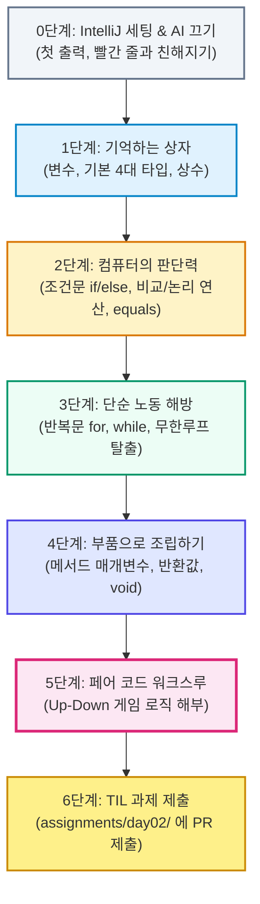

# [Hands-on] 4시간 만에 끝내는 코딩 기초와 Java 첫걸음

> **과정명** : 코딩 무경험자를 위한 Java 프로그래밍 핵심 기초 (Day 01)  
> **강사** : 생존코딩 오준석  
> **진행 방식** : 설명 20% + 직접 따라치기 80% (구글 Codelab 방식)  
> **실습 환경** : IntelliJ IDEA (⚠️ 모든 AI 어시스턴트 기능 비활성화)  
> **최종 목표** : 프로그래밍 5대 기둥(변수, 상수, 조건문, 반복문, 메서드)의 동작 원리를 손으로 직접 체득하고 첫 날 과정을 완성한다.

---

## 🧭 4시간 학습 로드맵 (Day 1 Flow)



---

## ⏱️ 4시간 타임테이블

| 교시 | 소요 시간 | 모듈명 | 핵심 개념 및 실습 |
| :---: | :---: | :--- | :--- |
| **1교시** | 50분 | **0단계: 환경 준비 & 첫 출력<br>1단계: 변수와 상수** | • IntelliJ 단일 통합 버전 설치 & JDK 21 원클릭 세팅<br>• IntelliJ AI 기능 끄기 (손맛 준비)<br>• `public static void main`의 의미<br>• 변수 선언/할당, 4대 자료형(`int`, `double`, `boolean`, `String`), `final` 상수<br>• [실습: 10분] 카페 주문 영수증 만들기 |
| **2교시** | 50분 | **2단계: 컴퓨터에게 두뇌 주기 (조건문)** | • 비교 연산자(`>`, `<`, `==`, `!=`) 및 논리 연산자(`&&`, `||`, `!`)<br>• `if - else if - else` 분기 처리<br>• ⚠️ 문자열 비교의 주의점: `==` vs `.equals()`<br>• [실습: 10분] 학점 자판기 |
| **3교시** | 50분 | **3단계: 컴퓨터가 사람을 이기는 무기 (반복문)** | • 100번 복붙의 비극과 반복문의 필요성<br>• 정해진 횟수 반복: `for`<br>• 조건이 끝날 때까지 반복: `while` & `break`<br>• [실습: 10분] 짝수만 더하는 청개구리 계산기 |
| **4교시** | 50분 | **4단계: 코드 묶음과 재사용 (메서드)<br>5단계: 종합 미션 & 6단계: 과제 제출** | • `main` 스파게티 코드의 한계와 메서드 필요성<br>• 메서드 3요소: 입력(매개변수), 작업, 출력(반환값), `void`<br>• [종합 미션: 15분] 👥 페어 코드 워크스루: Up-Down 게임 로직 해부<br>• 6단계: 첫 날 마무리 및 `assignments/day02/` TIL PR 제출 |

---

## 0단계: 무기 준비와 첫 출력 (AI 끄고 손맛 시작하기)

> 🎯 **핵심 목표** : 개발 도구(IntelliJ)에서 AI 자동 생성을 끄고, 내 손으로 직접 첫 자바 프로그램을 작성하여 화면에 출력합니다. 빨간 줄(컴파일 에러)을 두려워하지 않는 마음가짐을 갖습니다.

### 0.1 IntelliJ IDEA & JDK 21 설치 (최신 통합 무료 버전)

최신 IntelliJ IDEA는 과거의 'Community / Ultimate' 에디션 구분이 사라지고 **단일 통합 설치(Unified Installer)** 로 바뀌었습니다. 유료 구독 없이도 자바 학습 및 개발에 필요한 핵심 기능은 **완전 무료(Free)** 로 영구 사용할 수 있습니다.

1. **IntelliJ IDEA 다운로드**:
   - 공식 다운로드 페이지 접속: [jetbrains.com/idea/download](https://www.jetbrains.com/idea/download/)
   - 메인 화면에 보이는 단일 `[Download]` 버튼을 클릭합니다.
   - 운영체제(OS)별 선택:
     - **Windows** : `.exe` 설치 파일 다운로드 후 실행 (기본 옵션 그대로 [Next] 클릭)
     - **macOS** : 본인 Mac 사양 선택 (**Apple Silicon** 또는 **Intel**) 후 `.dmg` 파일을 열어 Applications 폴더로 드래그

2. **첫 실행 및 무료 사용 설정**:
   - IntelliJ를 처음 실행하면 라이선스 창이 뜹니다.
   - 유료 결제할 필요 없이 `[Continue with Free Features]` (또는 비상업적 무료 사용 안내)를 선택하여 시작합니다.

3. **JDK 21 초간단 원클릭 설치 (별도 사이트 방문 불필요!)**:
   - 오라클 사이트에 가서 회원가입하고 JDK를 따로 설치할 필요가 없습니다.
   - IntelliJ 첫 화면에서 `[New Project]` 클릭 시 `JDK` 항목 드롭다운에서 `[Download JDK...]`를 선택합니다.
   - **Version** : `21` 선택
   - **Vendor** : `Amazon Corretto` 또는 `Eclipse Temurin` 선택 후 [Download] 클릭
   - IntelliJ가 알아서 10초 만에 JDK 21을 컴퓨터에 내려받아 자동 연결해 줍니다.

---

### 0.2 왜 첫날 AI를 완전히 꺼야 하는가?

최신 IDE(IntelliJ)는 AI 어시스턴트 기능이 막강하여, 타이핑을 몇 글자만 쳐도 회색 글씨(Ghost Text)로 코드를 대신 써줍니다.  
하지만 **코딩 무경험자가 탭(Tab) 키만 눌러 완성하면 다음 세 가지를 영원히 배우지 못합니다**:

1. **문법 감각 결여**: 괄호 `()`, 중괄호 `{}`, 마침표 세미콜론 `;`의 짝 맞추기를 뇌가 기억하지 못합니다.
2. **에러 해결 능력 상실**: 오타가 났을 때 왜 빨간 줄이 뜨는지, 어떻게 읽어야 하는지 모르게 됩니다.
3. **사고의 흐름 단절**: "내가 컴퓨터에게 무엇을 시키고 있는가?"를 스스로 생각하지 않게 됩니다.

> 💡 **오늘의 원칙**: 오늘 4시간만큼은 온전히 내 손가락 근육으로 코드를 입력합니다. 빨간 줄이 뜨는 것은 실패가 아니라, 컴퓨터가 내 오타를 친절히 교정해 주는 배움의 기회입니다!

---

### 0.3 IntelliJ AI 기능 비활성화 설정

IntelliJ를 실행한 후 다음 설정을 확인하여 꺼줍니다:

1. **설정창 열기** :
   - macOS: `Cmd + ,`
   - Windows: `Ctrl + Alt + S`
2. **Full Line Code Completion (자동 완성 추천) 끄기** :
   - 검색창에 `Full Line` 검색 $\rightarrow$ [Editor] > [General] > [Code Completion] 이동
   - `Machine Learning-Assisted Completion` 또는 `Enable Full Line suggestions` 체크 해제
3. **AI Assistant 비활성화** (설치되어 있는 경우) :
   - [Plugins] $\rightarrow$ `Installed` 탭 $\rightarrow$ `AI Assistant` 체크 해제 후 적용(Apply)

---

### 0.4 새 프로젝트 생성 및 첫 파일 만들기

1. IntelliJ 첫 화면에서 [New Project]를 클릭합니다.
2. 설정값:
   - **Name** : `java-basics`
   - **Language** : `Java`
   - **Build system** : `IntelliJ`
   - **JDK** : `21` (또는 설치된 17 이상의 버전)
3. [Create]를 누르면 새 프로젝트 창이 열립니다.
4. 좌측 프로젝트 탐색기에서 `src` 폴더를 우클릭 $\rightarrow$ [New] > [Java Class] 클릭 $\rightarrow$ 파일명 `HelloJava` 입력 후 Enter!

---

### 0.5 첫 코드 따라치기: `HelloJava.java`

`HelloJava.java` 파일에 아래 코드를 **복사하지 말고 한 글자씩 직접 타이핑** 해 봅니다:

```java
public class HelloJava {
    public static void main(String[] args) {
        System.out.println("안녕하세요, 자바의 세계에 오신 것을 환영합니다!");
        System.out.println("생존코딩 오준석의 4시간 완성 코딩 기초 시작!");
    }
}
```

#### 🔍 초보자를 위한 코드 해설: 지금 기억할 것 vs 나중에 배울 것
- `public class HelloJava`: "이 파일은 `HelloJava`라는 부품이다"라는 선언입니다. (파일명과 반드시 대소문자까지 똑같아야 합니다!)
- `public static void main(String[] args)`:
  - 🧙‍♂️ **오늘의 팁** : 지금은 "**자바 프로그램이 시작되는 입구(문)**" 라고 주문처럼 외웁시다! 
  - `main`이라는 문이 없으면 자바는 어디서부터 실행해야 할지 몰라 헤맵니다.
  - *(`public`, `static`, `void`, `class`의 구체적인 의미는 나중에 클래스를 배울 때 명쾌하게 풀리니 지금은 넘어가도 좋습니다!)*
- `System.out.println(...)`: 콘솔 화면에 괄호 안의 글자를 찍고 **한 줄을 띄워라(print line)** 는 명령어입니다.
- `;` (세미콜론): **문장의 마침표** 입니다. 자바는 문장 끝에 세미콜론이 없으면 문장이 끝난 줄 모르고 화를 냅니다.

#### ▶️ 실행하기
- 코드 왼쪽의 **초록색 재생 버튼(▶️)**을 누르거나, 단축키(`Shift + F10` / macOS `Ctrl + R`)를 누릅니다.
- 하단 실행창(Run)에 내가 작성한 문장이 출력되는 것을 확인합니다!

---

### 0.6 [손맛 테스트] 일부러 빨간 줄 내보기
1. `System.out.println` 끝의 세미콜론(`;`)을 하나 지워보세요.
2. 빨간 줄에 마우스를 올려보세요: `';' expected` 라는 에러 메시지가 뜹니다.
3. 다시 세미콜론을 넣으면 빨간 줄이 사라집니다.  
   $\rightarrow$ "**빨간 줄은 에러의 위치를 알려주는 내비게이션이다!**" 를 기억하세요.

---

## 1단계: 기억하는 이름표 상자 (변수와 상수)

> 🎯 **핵심 목표** : 컴퓨터가 데이터를 기억하는 원리(변수)를 이해하고, 자바의 기본 4대 자료형을 손에 익히며, 절대 변하지 않는 값인 상수를 다룹니다.

### 1.1 변수(Variable)란 무엇인가?

컴퓨터는 계산 능력이 엄청나지만, **어딘가에 적어두지(기억하지) 않으면 방금 계산한 값도 1초 만에 까먹습니다.**

- **변수(Variable)** : 데이터를 담아두는 "**이름표가 붙은 메모리 상자**" 입니다.
- 상자를 만들 때 자바는 엄격하게 규칙을 요구합니다:
  > "**상자의 크기와 형태(자료형)를 먼저 정하고, 상자 이름(변수명)을 붙여라!**"

```java
int age;       // 1. 상자 만들기 (정수를 담는 age라는 상자 선언)
age = 25;      // 2. 값 집어넣기 (대입/할당)

int score = 90; // 선언과 동시에 값을 넣을 수도 있음!
```

> [!WARNING]
> 프로그래밍에서 `=` 기호는 "수학의 같다"가 아니라, "**오른쪽에 있는 값을 왼쪽 상자에 집어넣어라!**" 는 뜻의 **대입 연산자** 입니다!

---

### 1.2 자바의 기본 4대 천왕 자료형 (Data Types)

수많은 자료형이 있지만, 초보자가 실무 전까지 알아야 할 핵심은 딱 **4개** 면 충분합니다:

| 자료형 (Type) | 담을 수 있는 데이터 | 예시 코드 | 기억할 포인트 |
| :---: | :--- | :--- | :--- |
| **`int`** | 정수 (소수점 없는 숫자) | `int level = 1;` | 나이, 개수, 점수, 레벨 |
| **`double`** | 실수 (소수점 있는 숫자) | `double weight = 65.5;` | 키, 몸무게, 시력, 확률 |
| **`boolean`** | 참 또는 거짓 (`true` / `false`) | `boolean isGameRunning = true;` | 전원 온/오프, 로그인 여부 |
| **`String`** | 문자열 (글자들의 묶음) | `String name = "홍길동";` | 반드시 **큰따옴표(`"..."`)** 로 감싼다 |

---

### 1.3 함께 따라치기: `VariablesEx.java`

새 클래스 `VariablesEx`를 만들고 직접 작성해 봅니다:

```java
public class VariablesEx {
    public static void main(String[] args) {
        // 1. 변수 선언과 초기화
        String playerName = "오준석";
        int level = 1;
        double health = 100.0;
        boolean isAlive = true;

        System.out.println("=== 게임 시작 ===");
        System.out.println("플레이어: " + playerName);
        System.out.println("현재 레벨: " + level);
        System.out.println("현재 체력: " + health);
        System.out.println("생존 여부: " + isAlive);

        // 2. 변수 값 변경 (상자의 내용물 바꾸기)
        System.out.println("\n--- 몬스터에게 공격당함! (-30 체력) ---");
        health = health - 30.0; // 기존 체력에서 30을 빼서 다시 health에 저장
        level = level + 1;      // 사냥 성공으로 레벨업!

        System.out.println("변경된 체력: " + health);
        System.out.println("변경된 레벨: " + level);
    }
}
```

> 💡 **문자열 더하기(`+`)의 마술** :  
> `"현재 레벨: " + level` 처럼 글자와 숫자를 `+`로 연결하면, 자바가 알아서 하나의 긴 문장으로 합쳐줍니다!

---

### 1.4 변하지 않는 값: 상수 (Constant)

게임을 만들다 보면 절대 바뀌면 안 되는 값이 있습니다:
- 하루는 24시간
- 지구의 중력 가속도
- 최대 수용 가능 인원 (MAX_USERS)

변수 앞에 **`final`** 키워드를 붙이면 그 상자는 "**자물쇠가 잠긴 상자(상수)**" 가 되어 값을 바꿀 수 없습니다:

```java
final int MAX_LEVEL = 99;
// MAX_LEVEL = 100; // ❌ 컴파일 에러! final 변수는 값을 다시 바꿀 수 없음
```

- **관례** : 상수는 보통 일반 변수와 구분하기 위해 **모두 대문자** 로 작성하고, 단어 사이는 언더바(`_`)로 잇습니다 (예: `MAX_HEALTH`, `SERVER_PORT`).

---

### 🥊 [1교시 실습 과제] 나만의 카페 주문 영수증 만들기 (⏱️ 10분)
- **제한 시간** : 10분 (작성 7분 + 출력 확인 3분)
- 클래스명: `CafeReceipt.java`
- 조건:
  1. 메뉴 이름(`menuName`), 커피 잔 수(`count`), 잔당 가격(`pricePerCup`), 테이크아웃 여부(`isTakeOut`) 변수를 선언하세요.
  2. 총 결제 금액(`totalPrice = count * pricePerCup`)을 계산하여 저장하세요.
  3. 최대 할인율 `final double MAX_DISCOUNT = 0.2;` 상수를 선언하세요.
  4. 콘솔에 예쁘게 영수증 형태로 출력해 보세요.

---

## 2단계: 컴퓨터에게 두뇌 주기 (조건문 if, else)

> 🎯 **핵심 목표** : 참/거짓을 따지는 조건문을 통해 컴퓨터가 상황에 따라 서로 다른 명령을 내리도록 프로그램의 흐름을 분기(Branch)시키는 법을 마스터합니다.

### 2.1 조건문이 왜 필요한가?

지금까지 작성한 코드는 위에서 아래로 한 줄씩 무조건 실행되었습니다.  
하지만 현실 세계의 프로그램은 조건에 따라 다르게 움직여야 합니다:
- 잔액이 부족하면 $\rightarrow$ "잔액이 부족합니다" 출력
- 비밀번호가 맞으면 $\rightarrow$ 로그인 성공, 틀리면 $\rightarrow$ 재입력 안내

---

### 2.2 조건을 따지는 무기: 비교 연산자와 논리 연산자

#### ① 비교 연산자 (결과는 항상 `true` 또는 `false`)
- `a > b` : a가 b보다 큰가?
- `a < b` : a가 b보다 작은가?
- `a >= b` : a가 b보다 크거나 같은가?
- `a <= b` : a가 b보다 작거나 같은가?
- `a == b` : a와 b가 **같은가?** (주의: `=`는 대입, `==`가 비교!)
- `a != b` : a와 b가 **다른가?**

#### ② 논리 연산자 (조건을 여러 개 묶을 때)
- `&&` (AND, 그리고): 양쪽 조건이 **모두 true** 여야 true
  - 예: `age >= 18 && hasTicket == true` (18세 이상이고 티켓도 있어야 함)
- `||` (OR, 또는): 둘 중 **하나라도 true** 면 true
  - 예: `isWeekend == true || isHoliday == true` (주말이거나 공휴일이면 쉼)
- `!` (NOT, 반대): true는 false로, false는 true로 뒤집음
  - 예: `!isGameOver` (게임 오버가 아니라면)

---

### 2.3 `if`, `else if`, `else` 문법 구조

```java
if (조건1) {
    // 조건1이 true일 때 실행
} else if (조건2) {
    // 조건1은 false이고, 조건2가 true일 때 실행
} else {
    // 위의 모든 조건이 false일 때 실행
}
```

---

### 2.4 함께 따라치기: `RideCheck.java` (롤러코스터 탑승 판별기)

새 클래스 `RideCheck`를 만들고 코드를 작성합니다:

```java
public class RideCheck {
    public static void main(String[] args) {
        int age = 11;
        double height = 135.0;
        boolean hasHeartDisease = false; // 심장 질환 여부

        System.out.println("나이: " + age + "세, 키: " + height + "cm");

        // 탑승 조건: 나이 12세 이상, 키 140cm 이상, 심장 질환이 없어야 함
        if (hasHeartDisease) {
            System.out.println("❌ 심장 질환이 있으므로 탑승할 수 없습니다.");
        } else if (age >= 12 && height >= 140.0) {
            System.out.println("🎉 축하합니다! 단독 탑승이 가능합니다.");
        } else if (age >= 10 && height >= 130.0) {
            System.out.println("⚠️ 보호자 동반 시에만 탑승할 수 있습니다.");
        } else {
            System.out.println("❌ 키 또는 나이 제한으로 탑승할 수 없습니다.");
        }
    }
}
```

---

### 2.5 ⚠️ [주의] 문자열(String) 비교는 `==`가 아니라 `.equals()` 사용!

숫자는 `==` 로 잘 비교되지만, **문자열만큼은 절대 `==` 가 아니라 `.equals()` 로 비교해야 합니다.**

```java
String inputPassword = "pass";
// ❌ 잘못된 방식: 문자열에 == 를 쓰면 원하는 결과가 나오지 않을 수 있음
if (inputPassword == "pass") { ... }

// ⭕ 올바른 정석: 반드시 .equals() 를 사용!
if (inputPassword.equals("pass")) {
    System.out.println("비밀번호 일치!");
}
```

- **선생님의 한마디** : 왜 문자열만 `==` 가 안 먹히고 `.equals()` 를 써야 하는지에 대한 구체적인 원리는 지금 다루기엔 너무 어렵습니다! 나중에 `String` 을 다시 배울 때 아주 자세하게 다룰 예정이니, 지금은 "**문자열 비교는 무조건 `.equals()` 다!**" 라는 규칙만 확실하게 기억해 두세요.

---

### 🥊 [2교시 실습 과제] 학점 자판기 (⏱️ 10분)
- **제한 시간** : 10분 (조건문 작성 7분 + 점수 테스트 3분)
- 클래스명: `GradeCalculator.java`
- 조건:
  - `int score = 85;` 변수를 선언하세요.
  - 90점 이상: "A 학점"
  - 80점 이상 90점 미만: "B 학점"
  - 70점 이상 80점 미만: "C 학점"
  - 70점 미만: "재수강 대상(F)입니다. 힘내세요!"
  - 점수를 95, 82, 60점으로 바꿔가며 출력이 정확히 분기되는지 확인해 보세요.

---

## 3단계: 컴퓨터가 사람을 이기는 유일한 무기 (반복문)

> 🎯 **핵심 목표** : 반복되는 연산을 컴퓨터에게 일임하는 `for` 문과 `while` 문의 차이를 이해하고, 무한 루프를 방지하는 조건을 손으로 설계합니다.

### 3.1 100번 복붙의 비극

만약 콘솔에 1부터 100까지 숫자를 출력해야 한다면?
```java
System.out.println(1);
System.out.println(2);
...
System.out.println(100); // 손가락 관절염 발생 😭
```
컴퓨터는 사람과 달리 지치지도 않고, 불평도 하지 않으며, 1초에 수억 번의 반복도 오차 없이 수행합니다.  
이것이 인간이 코딩을 배워 컴퓨터를 부리는 가장 강력한 이유입니다.

---

### 3.2 횟수가 정해진 반복: `for` 문

`for` 문은 "**몇 번 반복할지**" 가 명확할 때 가장 많이 씁니다:

```java
for (초기식; 조건식; 증감식) {
    // 반복할 코드
}
```

```java
for (int i = 1; i <= 5; i++) {
    System.out.println(i + "번째 안녕!");
}
```
- `int i = 1`: **시작점** (카운터 변수 i를 1로 세팅)
- `i <= 5`: **도착점(조건)** (i가 5 이하인 동안만 계속 돈다)
- `i++`: **보폭(증감)** (한 바퀴 돌 때마다 i를 1씩 증가시킨다. `i = i + 1`과 동일)

---

### 3.3 조건이 맞을 때까지 계속 도는: `while` 문

`while` 문은 "**특정 조건이 끝날 때까지**" 계속 돌릴 때 씁니다:

```java
while (조건식) {
    // 조건이 true인 동안 계속 반복
}
```

```java
int energy = 5;
while (energy > 0) {
    System.out.println("달리는 중... 남은 에너지: " + energy);
    energy--; // 에너지를 1씩 깎음 (이게 없으면 평생 멈추지 않는 무한 루프!)
}
System.out.println("방전되었습니다!");
```

---

### 3.4 함께 따라치기: `LoopEx.java` (누적 합계와 구구단)

새 클래스 `LoopEx`를 만들고 코드를 작성합니다:

```java
public class LoopEx {
    public static void main(String[] args) {
        // 1. 1부터 10까지의 합 구하기 (for 문)
        int sum = 0;
        for (int i = 1; i <= 10; i++) {
            sum = sum + i;
        }
        System.out.println("1부터 10까지의 총합: " + sum);

        System.out.println("\n--- 구구단 7단 출력 ---");
        int dan = 7;
        for (int i = 1; i <= 9; i++) {
            System.out.println(dan + " * " + i + " = " + (dan * i));
        }

        System.out.println("\n--- 폭탄 카운트다운 (while 문) ---");
        int countdown = 5;
        while (countdown > 0) {
            System.out.println(countdown + "초 전...");
            countdown--;
        }
        System.out.println("💥 쾅!!");
    }
}
```

---

### 3.5 무한 루프와 탈출 버튼 `break`

조건을 항상 참(`while (true)`)으로 두면 무한히 반복됩니다. 이때 특정 조건에서 반복문을 깨고 탈출하려면 **`break`** 를 사용합니다:

```java
int count = 1;
while (true) {
    System.out.println("현재 번호: " + count);
    if (count == 3) {
        System.out.println("3번에 도달하여 탈출합니다!");
        break; // 반복문을 즉시 중단하고 밖으로 나감
    }
    count++;
}
```

---

### 🥊 [3교시 실습 과제] 짝수만 더하는 청개구리 계산기 (⏱️ 10분)
- **제한 시간** : 10분 (for+if 작성 7분 + 합계 출력 3분)
- 클래스명: `EvenSum.java`
- 조건:
  - 1부터 30까지의 숫자 중에서 **짝수만 골라서** 합계를 구하세요.
  - 힌트: `for` 문 안에 `if (i % 2 == 0)` (2로 나눈 나머지가 0이면 짝수!) 조건문을 결합합니다.
  - 최종 짝수들의 합이 얼마인지 출력하세요.

---

## 4단계: 부품으로 조립하기 (메서드 / 함수)

> 🎯 **핵심 목표** : 코드 중복을 제거하고 기능을 모듈화하는 메서드(함수)의 구조를 익히고, 프로그램 로직을 부품 단위로 조립하는 기초를 완성합니다.

### 4.1 모든 코드를 `main`에 다 때려박았을 때 생기는 재앙

지금까지 우리는 모든 코드를 `main` 메서드 중괄호 안에 전부 다 집어넣었습니다.  
만약 프로그램이 10,000줄이 넘어가고, 같은 계산 로직을 수십 번 반복해야 한다면?
- 코드가 너무 길어져 스크롤을 5분 동안 내려야 함
- 같은 코드를 수십 번 복붙했다가, 로직이 바뀌면 수십 군데를 일일이 찾아서 고쳐야 함 (버그 폭탄!)

$\rightarrow$ **해결책** : 자주 쓰는 코드 조각에 이름을 붙여 "**재사용 가능한 부품(자판기)**" 으로 분리하자! 이것이 바로 **메서드(Method)** 입니다.

---

### 4.2 메서드의 자판기 비유와 구조

메서드는 **자판기** 와 완벽히 똑같습니다:
1. **입력 (매개변수, Parameter)** : 자판기 동전 투입구에 넣는 동전
2. **동작 (본문 코드)** : 자판기 안에서 음료수를 꺼내는 기계 동작
3. **출력 (반환값, Return)** : 자판기 배출구로 툭 떨어지는 음료수

```text
반환타입 메서드이름(입력타입 매개변수이름) {
    실행할 작업 코드;
    return 반환할값;
}
```

```java
// 두 정수를 넣으면(int a, int b), 그 합을 계산해서 정수(int)로 돌려주는 자판기
public static int add(int a, int b) {
    int result = a + b;
    return result; // 결과를 들고 호출한 곳으로 돌아감
}
```

> [!NOTE]
> **`void`는 도대체 무슨 뜻인가요?**  
> 반환값 자리에 `void`가 적혀 있다면, "**이 자판기는 돌려주는 물건 없이 화면에 찍고 끝내는 자판기다(반환값 없음)**" 라는 뜻입니다! (예: 단순 안내문 출력용 메서드)

---

### 4.3 함께 따라치기: `MethodEx.java`

새 클래스 `MethodEx`를 만들고 코드를 작성합니다:

```java
public class MethodEx {

    // 1. 반환값과 입력값이 모두 있는 메서드 (두 수의 합)
    public static int add(int num1, int num2) {
        int sum = num1 + num2;
        return sum;
    }

    // 2. 입력값은 있지만 반환값은 없는 메서드 (void)
    public static void greet(String name) {
        System.out.println("반갑습니다, " + name + "님!");
        System.out.println("오늘도 즐거운 자바 코딩 되세요.");
    }

    // 3. 성인 여부를 판별해서 boolean을 돌려주는 메서드
    public static boolean isAdult(int age) {
        if (age >= 19) {
            return true;
        } else {
            return false;
        }
    }

    public static void main(String[] args) {
        System.out.println("=== 메서드 호출 실습 ===");

        // greet 메서드 호출
        greet("오준석");
        greet("홍길동");

        // add 메서드 호출 및 결과 받기
        int calcResult = add(10, 20);
        System.out.println("10 + 20 = " + calcResult);

        // isAdult 메서드 호출
        boolean adultCheck = isAdult(15);
        System.out.println("15세는 성인인가요? " + adultCheck);
    }
}
```

---

## 5단계: [종합 미션] 👥 페어 코드 워크스루: Up-Down 게임 로직 해부 (⏱️ 15분)

> 🎯 **미션 목표** : 2인 1조가 되어 완성된 게임 코드를 한 줄씩 뜯어보며, 오늘 배운 5대 기둥(변수, 상수, 조건문, 반복문, 메서드)이 컴퓨터 내부에서 어떻게 맞물려 돌아가는지 상호 설명하고 분석합니다. (제한 시간: 15분)

### 5.1 완성 코드 넣기: `UpDownGame.java`

`src` 폴더에 `UpDownGame` 클래스를 생성하고 아래 완성 코드를 넣은 뒤 한 번 실행(▶️)하여 정상 동작을 확인합니다:

```java
import java.util.Scanner;

public class UpDownGame {

    // 안내 메시지를 출력하는 메서드
    public static void printWelcome() {
        System.out.println("================================");
        System.out.println("🎮 1부터 50 사이의 숫자를 맞춰보세요!");
        System.out.println("================================");
    }

    // 힌트를 출력하고 정답 여부를 반환하는 메서드
    public static boolean checkGuess(int target, int userGuess) {
        if (userGuess == target) {
            System.out.println("🎯 정답입니다! 축하합니다!");
            return true; // 맞춤!
        } else if (userGuess < target) {
            System.out.println("🔼 UP! 더 큰 숫자입니다.");
            return false;
        } else {
            System.out.println("🔽 DOWN! 더 작은 숫자입니다.");
            return false;
        }
    }

    public static void main(String[] args) {
        // 키보드 입력을 받기 위한 자바 도구 (Scanner)
        Scanner scanner = new Scanner(System.in);

        int targetNumber = 37; // 우리가 맞출 정답 숫자 (1~50)
        int attempts = 0;      // 시도 횟수를 셀 변수
        boolean isCorrect = false;

        printWelcome();

        // 정답을 맞출 때까지 무한 반복
        while (!isCorrect) {
            System.out.print("숫자를 입력하세요: ");
            int guess = scanner.nextInt(); // 사용자가 친 숫자 읽기
            attempts++;

            // 메서드를 호출하여 판정받기
            isCorrect = checkGuess(targetNumber, guess);
        }

        System.out.println("총 " + attempts + "번 만에 정답을 맞추셨습니다!");
        scanner.close();
    }
}
```

---

### 5.2 👥 [2인 1조 페어 워크스루] 역할 분담 코드 해부하기

옆 사람과 역할을 나누어 각자의 영역을 2분간 분석한 뒤, 상대방에게 사람의 말로 설명해 줍니다:

#### 🔍 역할 A (메서드 탐정) : `checkGuess` 메서드 분석
- 이 메서드는 몇 개의 입력값(매개변수)을 받아서 어떤 작업을 수행하나요?
- 왜 반환 타입이 `boolean`(`true` / `false`)으로 설계되었을까요?
- **짝꿍에게 설명할 미션** : 이 메서드가 어떤 일을 하는 부품인지 나만의 비유를 들어 짝꿍에게 설명해 보세요.

#### 🔄 역할 B (루프 탐정) : `while` 반복문 분석
- 처음 시작할 때 `isCorrect` 변수는 무슨 값이며, 왜 `while (!isCorrect)`라고 썼을까요?
- 정답을 맞혔을 때 이 무한 루프가 멈추게 되는 데이터의 흐름은 어떻게 이어질까요?
- **짝꿍에게 설명할 미션** : 사용자가 숫자를 맞혔을 때 프로그램이 어떻게 루프를 탈출해 끝나는지 짝꿍에게 설명해 보세요.

---

### 5.3 🕵️‍♂️ [페어 도전 과제] 코드 추적 퀴즈

두 사람이 함께 머리를 맞대고 코드를 어디를 고쳐야 할지 찾아보세요:

1. **퀴즈 1 (난이도 변경)** : 정답 숫자 범위를 `1~100`으로 넓히려면 코드에서 총 몇 군데를 수정해야 할까요? 두 사람이 코드를 읽으며 위치를 찾고 직접 수정해서 실행해 보세요.
2. **퀴즈 2 (5회 제한 룰 추가)** : 5번 넘게 시도하면 "기회 소진!"을 띄우고 게임을 끝내려고 합니다. 오늘 배운 조건문(`if`)과 탈출문(`break`)을 코드의 어느 흐름에 배치해야 할지 짝꿍과 상의하여 추가해 보세요.

---

## 6단계: [과제 제출] Day 01 학습 완료! TIL 과제 제출하기

> 🎯 **과제 목표** : 오늘 4시간 동안 직접 손으로 치며 배운 핵심 내용과 트러블슈팅 경험을 마크다운으로 정리하여, 공용 과제 저장소의 `assignments/day02/` 폴더에 Pull Request(PR)로 제출합니다.

### 6.1 과제 규정 및 제출 형식

| 구분 | 규칙 | 예시 |
| :--- | :--- | :--- |
| **과제 저장 위치** | `assignments/day02/이름.md` | `assignments/day02/홍길동.md` |
| **작업 브랜치명** | 자유 (본인이 구분 가능한 이름) | `docs/gildong-hong` |
| **PR 제목 형식** | `날짜_번호_이름` | `260910_10_홍길동` |

---

### 6.2 TIL 과제 작성 템플릿 (`assignments/day02/본인이름.md`)

아래 양식을 복사하여 `assignments/day02/본인이름.md` 파일에 채워 넣습니다:

```markdown
# [TIL] Day 01 - 코딩 기초와 Java 첫걸음

- 작성자: 
- 작성일: 

---

## 1. 오늘 내가 직접 손으로 치며 배운 점
- 
- 

## 2. 가장 멘붕이었던 순간 & 트러블슈팅
- 
- 

## 3. 나만의 언어로 재해석한 핵심 용어 사전
- 
- 
```

---

### 6.3 Step-by-Step 과제 제출 절차

터미널을 열고 다음 순서대로 진행하여 PR을 제출합니다:

```bash
# 1. 과제 제출용 브랜치 생성 및 이동 (브랜치 이름은 자유)
git checkout -b docs/gildong-hong
# (또는 최신 switch 명령어: git switch -c docs/gildong-hong)

# 2. day02 과제 폴더 생성 (없을 경우)
mkdir -p assignments/day02

# 3. 과제 파일 작성 (에디터로 열어 템플릿 채우기)
code assignments/day02/홍길동.md

# 4. 커밋 및 내 원격 저장소로 푸시
git add assignments/day02/홍길동.md
git commit -m "docs: 홍길동 Day 01 Java 기초 TIL 제출"
git push -u origin docs/gildong-hong
```

푸시가 완료되면 GitHub 저장소 웹페이지에서 `[Compare & pull request]` 초록색 버튼을 클릭하여 PR을 생성합니다! 오늘 하루 수고 많으셨습니다. 🎉
